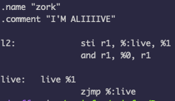
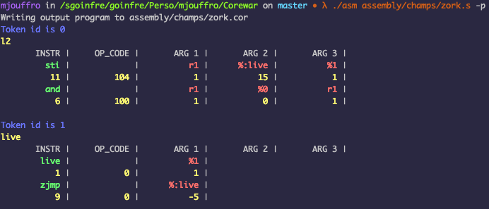
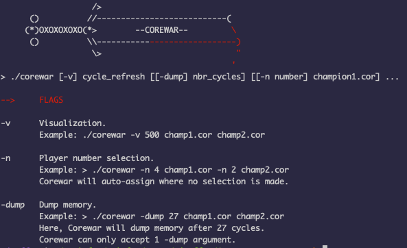
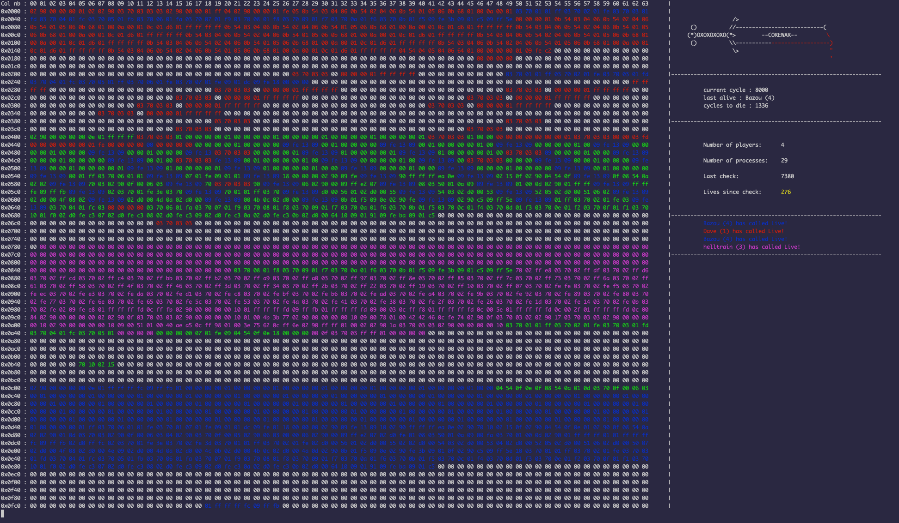

# Corewar
An implementation of the programming game “Core War” 
Algorithmic Project @ 42 Paris

## About
> Core War is a 1984 programming game created by D. G. Jones and A. K. Dewdney in which two or more battle programs 
> (called "warriors") compete for control of a virtual computer. 
> These battle programs are written in an abstract assembly language called Redcode.

## Project Structure

- Champion
- Assembler
- Debugger (Bonus)
- Virtual Machine
- Visualizer (Bonus)

## Installation
git clone https://github.com/MathieuJouffroy/Corewar.git && cd Corewar && make

### ASM 
#### Parsing and compiling the champion into valid bytecode
The virtual machine will execute a bytecode that will be generated by your assembler. 
The assembler (the program) will get a file written in assembly language as argument 
and generate a champion that will be understood by the virtual machine. 
The executable outputs a '.cor'(compiled champion in bytecode) from the '.s' source file 

Usage: ./asm champion.s
    champion.s   — from assembler to bytecode

#### Champion example

#### Debugger
The instructions written in a lightweight custom assembly code and theirr value in 

### VM (corewar)
The virtual machine (a circular area of memory) will run the bytecode generated by the ASM.
This VM will implement the rules of Core War: 
- each champion executes it's instructions in order
- they must execute 'LIVE' at least once per 'CYCLE_TO_DIE' 
- while trying to stop the other champions from doing the so.

Usage : ./corewar [-dump, -v [cycle_nb]] [[-n player_nb] champion1.cor] [[-n player_nb] champion2.cor] ... 
- dump <num> : Dump memory (32 octets per line) after <num> cycles and exit 
- v          : Run visualizer 
- n    <num> : Set <num> of the next player 

### Game Visualizer

